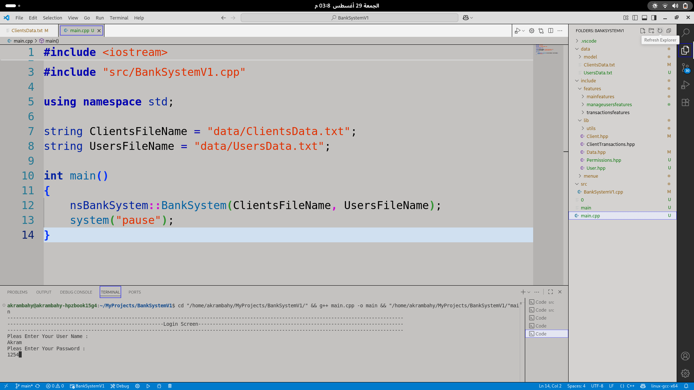
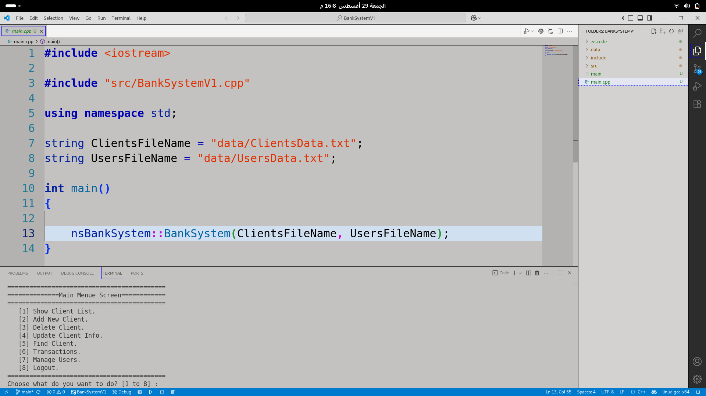
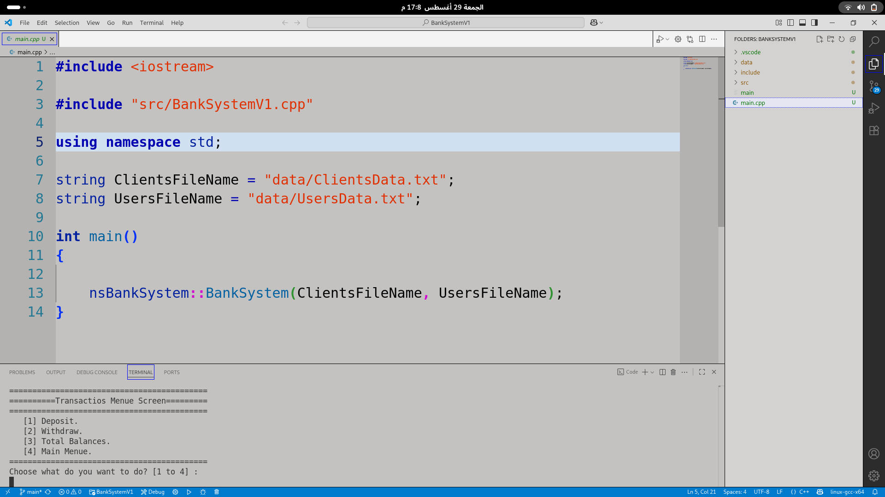
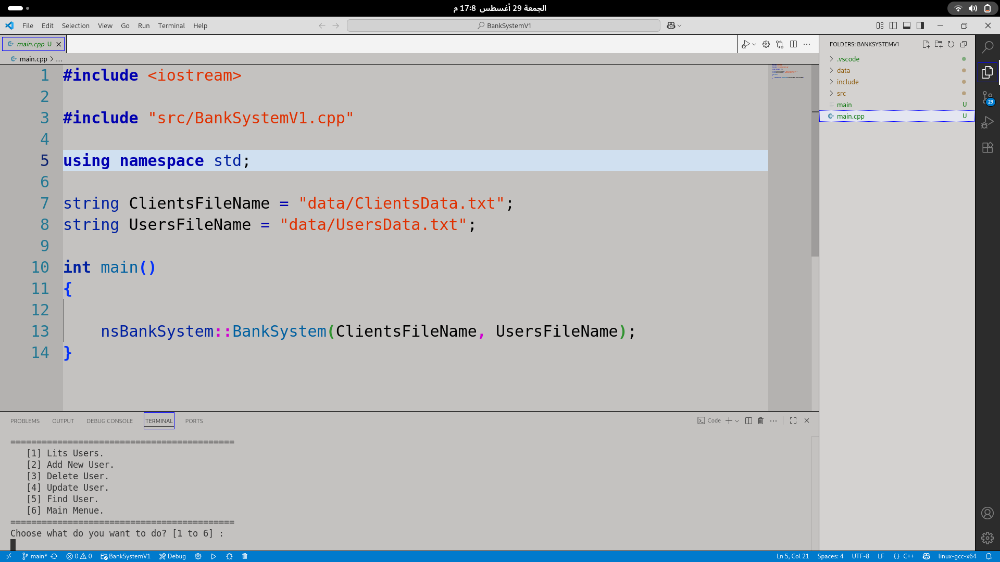

# 🏦 Bank System (C++ Project)

##  Overview
This is a **Bank Management System** implemented in **C++**.  
It was developed as a **student project** to practice system design, file handling, and clean coding principles.  
The system simulates basic banking operations with role-based access control.

---

##  Features
-  User & Admin roles with different permissions  
-  Customer account management (Add / Update / Delete)  
-  Financial transactions (Deposit / Withdraw / Transfer)  
-  Persistent storage using text files (File I/O)  
-  Layered architecture:
  - **Data Layer** – file handling and storage  
  - **Business Logic Layer** – rules and operations  
  - **Presentation Layer** – console-based user interaction  

---

## BankSystem
├──  include/       # Header files (.h / .hpp)
├── src/           # Source files (.cpp)
├── data/          # Text files for storage
├── main.cpp       # Entry point
├── README.md      # Project documentation
 
---

## Learning Outcomes

- Through this project, I practiced 

- Organizing code into Header / Source Files

- Using Structs and Enums to model data and permissions

- Applying File I/O for persistent storage

- Writing Clean Code for maintainability and scalability

- Designing a small-scale but real-world inspired system

--- 

## Demo

### Login Screen

### Main Menu

### Transactions

### Manage Users

